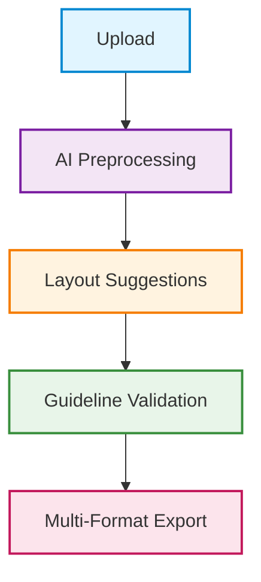
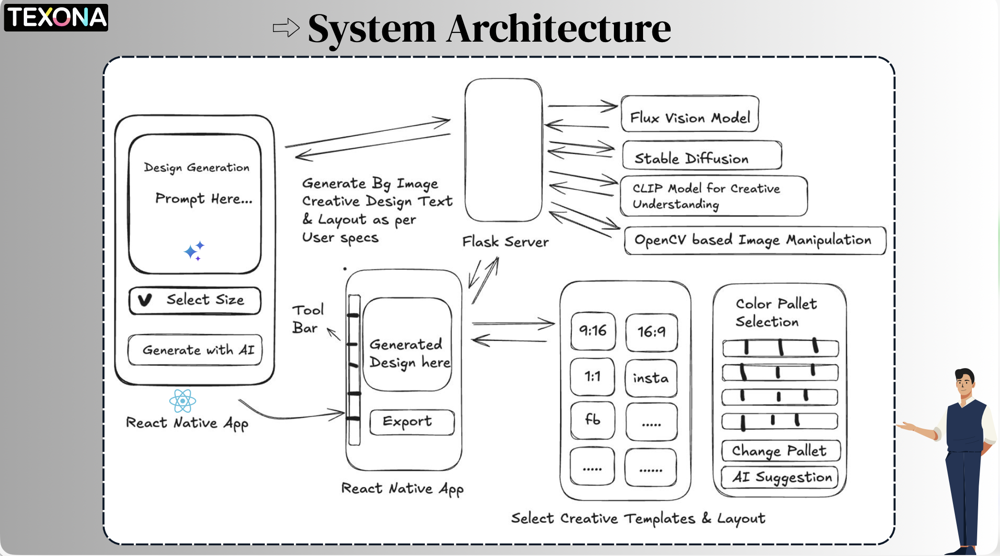
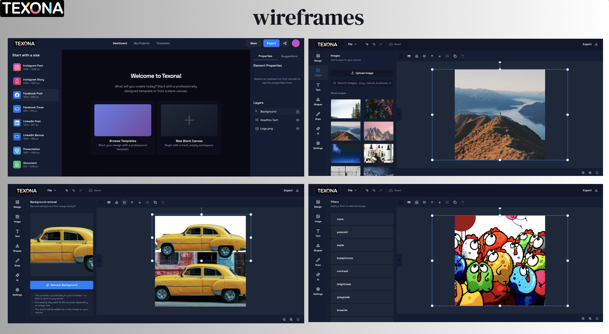

# Texona
**Where Creativity Meets Automation**

AI-Powered Retail Media Creative Tool for generating guideline-compliant, professional-quality creatives in minutes.

## Demo
- **Live Prototype**: [https://texona-editor.vercel.app/](https://texona-editor.vercel.app/)
- **Demo Video**: [Watch on YouTube](https://youtu.be/Zn3ngCZ-7hY?si=xbGz2mPNJM5L1NSf)

## Problem Statement
- **70%** of marketing teams spend more time resizing/adapting creatives than actual design
- Strict retailer compliance requirements increase revision cycles
- Small advertisers lack access to creative agencies
- Brands need **10-25 creative variations** per campaign
- Existing tools don't enforce guidelines or generate multi-format creatives efficiently

## Solution
Texona is a Generative AI platform that creates retailer-compliant creatives in under **5 minutes** (vs. 2-3 hours traditional workflow).

### Key Features
- **AI-Powered Generation**: Create creatives from text prompts
- **Visual Editor**: Precision editing with Fabric.js canvas
- **Background Removal**: Automatic image preprocessing
- **Multi-Format Export**: Facebook/Instagram sizes (1080x1080, 1080x1920, 1200x628)
- **Template System**: Reusable brand assets and layouts
- **Image Filters**: Professional enhancements (polaroid, sepia, kodachrome, etc.)
- **Guideline Validation**: Automated compliance checking
- **Optimized Exports**: JPEG/PNG under 500KB

### End-to-End Flow



**Workflow Steps:**
1. **Upload** - Packshots, backgrounds, logos, brand assets
2. **AI Preprocessing** - Background removal, enhancement, product clarity
3. **Layout Suggestions** - AI-driven balanced layouts based on visual hierarchy
4. **Guideline Validation** - Automated retailer & brand compliance checking
5. **Multi-Format Export** - JPEG/PNG/PDF under 500KB for all social formats

## System Architecture



## WireFrames



## Tech Stack
- **Frontend**: Next.js, React, Fabric.js
- **Backend**: Hono, Node.js
- **AI Models**: Stable Diffusion, Flux Vision, CLIP
- **Image Processing**: OpenCV, PIL, background-removal
- **Database**: Drizzle ORM, Neon PostgreSQL
- **Storage**: IndexedDB (local), Firebase
- **Deployment**: Vercel

## Getting Started

```bash
npm install
npm run dev
```

Open [http://localhost:3000](http://localhost:3000)

## Key Differentiators
- **90% time reduction** in creative production
- **AI-driven layout engine** based on visual hierarchy
- **Smart resize** maintaining aspect ratio and quality
- **Aesthetic quality scoring** for engagement optimization
- **Guideline validation** eliminating 25% of failed submissions

## Team Malaai
Machine Learning and Artificial Intelligence

- Pushpender Singh - Mobile App Developer
- Khusbu Rai - Backend Developer
- Nikita Babbar - Gen AI Engineer
- Piyush Singh - AI/ML Engineer
  
  ## 📄 Team Resumes

- 👩‍💻 **Nikita Babbar – Gen AI Engineer**  
  📘 [View Resume (PDF)]([./Nikita_Babbar_Resume.pdf](https://github.com/khusburai28/Texona/blob/main/Nikita_Babbar_Resume%20(10).pdf))

- 👨‍💻 **Piyush Singh – AI/ML Engineer**  
  📘 [View Resume (PDF)]([./Piyush_Kumar_Resume.pdf](https://github.com/khusburai28/Texona/blob/main/Piyush_Kumar_Resume_GEN_AI%20(1).pdf))


## Impact
- Reduces production from 3.5 hours to 5 minutes
- Enables 15-30 A/B test variations per session
- Improves time-to-market by 60%
- Enhances brand consistency (34% recall improvement)
- Reduces creative costs by 15-25%
